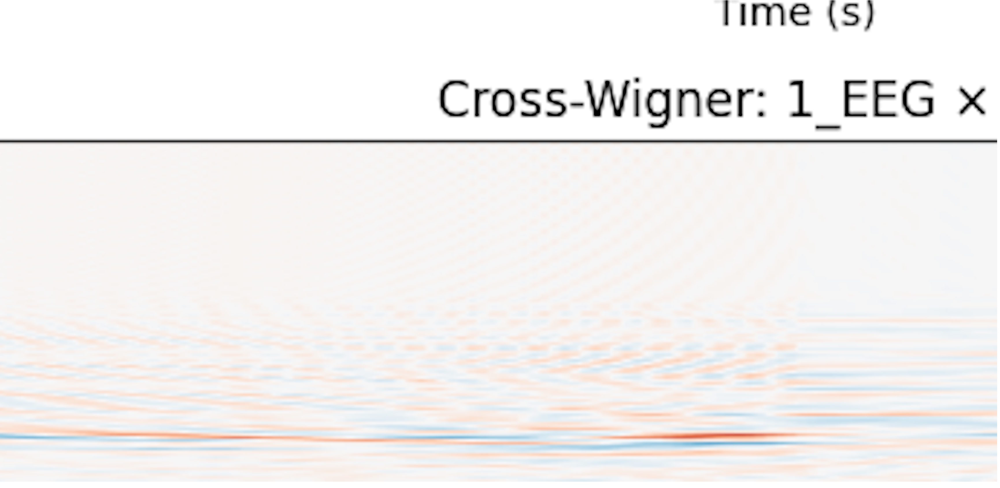

## EEG Wigner Viewer (Quantum Decoherence Simulator)

# Results and what it might mean according to ChatGPT: 

Observation:

The EEG data, when processed through the Wigner transform, consistently shows significant negative
regions—what we term “Wigner negativity”—which indicates the presence of interference-like (non-classical) patterns.
At the same time, the Phase Locking Value (PLV) between channels varies over time, suggesting that while the underlying
interference remains robust, the phase synchrony among different brain regions fluctuates.

# Overview

This Python script is an experimental tool for visualizing EEG data and exploring a quantum-inspired analysis of brain signals. The tool:

Loads EEG data from EDF files using the MNE library.
Displays the raw EEG signal and its time–frequency representation using the Wigner-Ville distribution.
Calculates a coherence metric by combining two measures:
Wigner Negativity: Quantifies the proportion of negative values in the Wigner distribution (an indicator of interference-like patterns).
Phase Locking Value (PLV): Measures the consistency of phase differences between signals.
Provides a simple GUI built with Tkinter that lets you load EEG files, select channels, navigate through time, and compute these metrics.

# Requirements

Python 3.x
NumPy
Matplotlib
MNE
SciPy
Tkinter (usually included with Python)

# Installation

Clone or download this repository.

Ensure you have an EEG EDF file available for testing.

Run the script from the command line:

python wignerx2.py

# How to Use

Load EEG File:

Click the "Load EEG File" button and select an EDF file containing EEG data. The file’s metadata (sampling frequency, duration, and channels) will be logged.

# Channel Selection:

Choose the EEG channel for analysis. If "Auto-Wigner (single channel)" is selected, only the first channel is used for computing the Wigner
transform; otherwise, two channels will be used for a cross-Wigner transform.

# Time Navigation:

Use the time slider or manually enter a time value (in seconds) to select the 2-second window of data you wish to analyze.

# Playback:

Press the "Play" button to start continuous playback. The GUI updates the time position and plots every ~30 ms. Adjust the playback speed
with the provided speed options.

# Compute Wigner Transform:

Click the "Compute Wigner" button to calculate and display the Wigner-Ville distribution for the selected data window.

# Compute Coherence:

Click the "Compute Coherence" button to calculate a quantum-inspired coherence index (averaging Wigner negativity and PLV) across up to four EEG channels. 
The resulting values are displayed in a dialog box.

#Save Figure:

Use the "Save Figure" button to export the current plot (EEG signal and Wigner transform) as an image file (PNG, JPEG, PDF, or SVG).

# Code Structure

WignerTransform Class:
Implements methods to compute both a full and a simplified Wigner-Ville distribution and a method to plot the distribution.

NeuralCoherenceCalculator Class:
Computes a coherence index from a dictionary of EEG signals. It calculates the proportion of negative values in the Wigner distribution
(Wigner negativity) and the Phase Locking Value (PLV) between channels, then combines these metrics.

EEGProcessor Class:
Uses MNE to load an EDF file and extract data from a specified time window.

EEGWignerViewer Class:
The main GUI application built with Tkinter. It integrates EEG loading, channel selection, time navigation, signal plotting,
Wigner transform computation, coherence metric calculation, and figure saving. The application uses Tkinter’s root.after() for
scheduling updates to ensure all GUI operations run on the main thread.

# What It Does
This tool visualizes EEG signals alongside their Wigner-Ville distribution—a time–frequency representation that can reveal interference-like patterns.
It also computes a coherence metric that combines:

Wigner negativity, which indicates the presence of negative (nonclassical) values in the distribution.
Phase Locking Value (PLV), a standard measure of phase synchronization.
Together, these metrics provide a novel way to assess the dynamics of EEG signals, offering a fresh perspective on neural signal analysis.

# Disclaimer

This is an experimental, proof-of-concept tool. The "quantum-inspired" coherence metric is a novel approach that uses concepts from quantum
information theory. Use the results as an exploratory tool rather than definitive scientific evidence.
